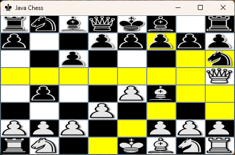

# jChess

Chess game written in Java using Java Swing

## How to run

Run the provided .jar file OR compile and run

1. `javac -d bin src/main/java/*.java`
2. `java -cp "bin;src/main/resources" ChessApp`

## How to build

1. `javac -d bin src/main/java/*.java`
2. `jar cvfm MyChessApp.jar Manifest.txt -C bin . -C src/main/resources .`

## Planned Features

- Block moves that place into check or yield checkmate
- Minimax algorithm for computer AI (multiple difficulties?)
- Game win/loss ratio tracking
